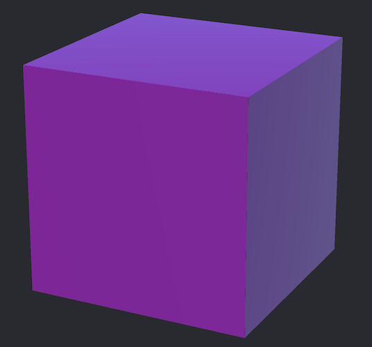
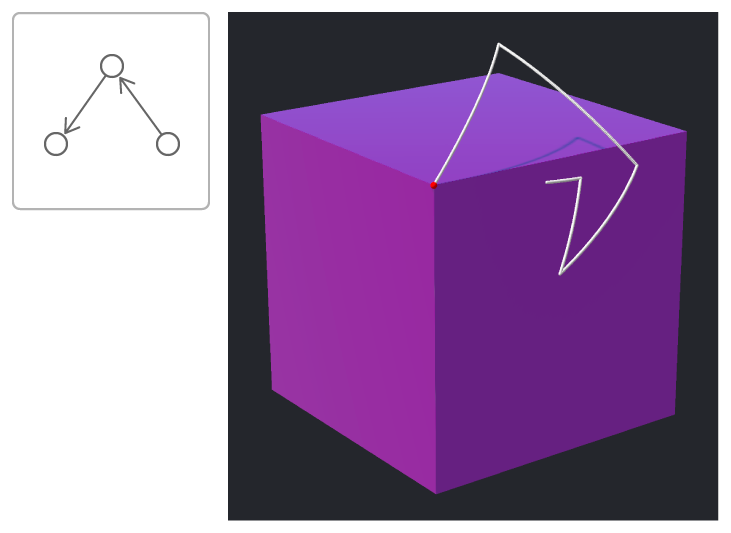
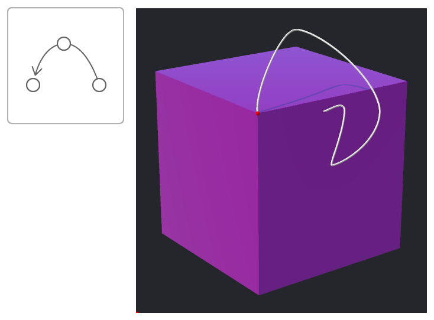

# Rotating a Cube by Transforming Its Vertices

Rotate a cube through a series of keyframes using quaternion interpolation to transition between them.

## Overview

Quaternions are fundamental to 3D drawing and animation. You can rotate a 3D object in space by applying unit quaternion actions to each of its vertices. You can interpolate between a series of rotational keyframes—defined by unit quaternions—with either the [`simd_slerp`](https://developer.apple.com/documentation/simd/2867359-simd_slerp) or the [`simd_spline`](https://developer.apple.com/documentation/simd/2867378-simd_spline) functions.

This sample shows how you can define a cube using eight vertices and transform it through a series of rotations. It shows how transitioning between the keyframes with a series of discrete spherical interpolations (that is, a series of separate arcs between each keyframe) yields a different result than transitioning with a continuous spline (that is, a single, smooth path between each keyframe). 

## Define a Cube by Its Vertices

Define a cube with eight [`simd_float3`](https://developer.apple.com/documentation/simd/simd_float3) structures: one for each corner:

``` swift
let cubeVertexOrigins: [simd_float3] = [
    simd_float3(x: -0.5, y: -0.5, z: 0.5),
    simd_float3(x: 0.5, y: -0.5, z: 0.5),
    simd_float3(x: -0.5, y: -0.5, z: -0.5),
    simd_float3(x: 0.5, y: -0.5, z: -0.5),
    simd_float3(x: -0.5, y: 0.5, z: 0.5),
    simd_float3(x: 0.5, y: 0.5, z: 0.5),
    simd_float3(x: -0.5, y: 0.5, z: -0.5),
    simd_float3(x: 0.5, y: 0.5, z: -0.5)
    ]
```

The quaternions will act upon the vertex origins, mutating `cubeVertices` to rotate the cube:

``` swift
lazy var cubeVertices = cubeVertexOrigins
```

This sample uses [SceneKit](https://developer.apple.com/scenekit/) to render the cube defined by the vertices in the `cubeVertices` array, but you can use the technique discussed to rotate geometry in other technologies like [Metal](https://developer.apple.com/metal/). The following image shows the cube, defined by the vertices above, rendered in SceneKit:



## Define the Quaternion Rotation Keyframes

As discussed in [Working with Quaternions](https://developer.apple.com/documentation/accelerate/simd/working_with_quaternions), spline interpolation requires a quaternion before the current value and a quaternion after the next value to compute the interpolated value. To support this, define the series of rotations with additional values at the beginning and end. In this sample, the first and last elements are duplicated:

``` swift
let vertexRotations: [simd_quatf] = [
    simd_quatf(angle: 0,
               axis: simd_normalize(simd_float3(x: 0, y: 0, z: 1))),
    simd_quatf(angle: 0,
               axis: simd_normalize(simd_float3(x: 0, y: 0, z: 1))),
    simd_quatf(angle: .pi * 0.05,
               axis: simd_normalize(simd_float3(x: 0, y: 1, z: 0))),
    simd_quatf(angle: .pi * 0.1,
               axis: simd_normalize(simd_float3(x: 1, y: 0, z: -1))),
    simd_quatf(angle: .pi * 0.15,
               axis: simd_normalize(simd_float3(x: 0, y: 1, z: 0))),
    simd_quatf(angle: .pi * 0.2,
               axis: simd_normalize(simd_float3(x: -1, y: 0, z: 1))),
    simd_quatf(angle: .pi * 0.15,
               axis: simd_normalize(simd_float3(x: 0, y: -1, z: 0))),
    simd_quatf(angle: .pi * 0.1,
               axis: simd_normalize(simd_float3(x: 1, y: 0, z: -1))),
    simd_quatf(angle: .pi * 0.05,
               axis: simd_normalize(simd_float3(x: 0, y: 1, z: 0))),
    simd_quatf(angle: 0,
               axis: simd_normalize(simd_float3(x: 0, y: 0, z: 1))),
    simd_quatf(angle: 0,
               axis: simd_normalize(simd_float3(x: 0, y: 0, z: 1)))
]
```
    
## Animate Between Keyframes with Spherical Interpolation

This sample uses a [`CADisplayLink`](https://developer.apple.com/documentation/quartzcore/cadisplaylink?changes=_8) instance to schedule updates to the cube’s vertices, calling the  `vertexRotationStep` function every frame:

``` swift
displaylink = CADisplayLink(target: self,
                            selector: #selector(vertexRotationStep))

displaylink?.add(to: .current,
                 forMode: .default)
```

The following variables define the current index in `vertexRotations` and the time, between zero and one, for the current interpolation:

``` swift
var vertexRotationIndex = 0
var vertexRotationTime: Float = 0
```

With each display link notification, inside the `vertexRotationStep` function, the vertex rotation time variable is incremented by a small amount. Changing the value of increment controls the speed of the animation:

``` swift
let increment: Float = 0.02
vertexRotationTime += increment
```

The `simd_slerp` function returns a quaternion that is spherically interpolated between the current and next quaternion keyframe at the specified time:

``` swift
q = simd_slerp(vertexRotations[vertexRotationIndex],
               vertexRotations[vertexRotationIndex + 1],
               vertexRotationTime)
```

The quaternion acts upon each of the cube’s original vertices, rotating the cube around its center:

``` swift
cubeVertices = cubeVertexOrigins.map {
    return q.act($0)
}
```

If the vertex rotation time is greater than or equal to one, you need to progress to the next keyframe: Increment the index to the rotations array and reset the rotation time to zero. Furthermore, when the code has reached the last usable quaternion in the array of rotations, end the animation by invalidating the display link:

``` swift
if vertexRotationTime >= 1 {
    vertexRotationIndex += 1
    vertexRotationTime = 0

    if vertexRotationIndex > vertexRotations.count - 3 {
        displaylink.invalidate()
        isRunning = false
    }
}
```

Over time, the cube animates through the series of keyframes. By tracing the path (shown as a thin line) of one of the vertices (marked by the dot), you can see the sharp change in direction as the cube rotates between the keyframes:



## Animate Between Keyframes with Spline Interpolation

Use the identical code to the spherical interpolation sample for spline interpolation, apart from one change: Rather than generating the quaternion that acts upon the vertices with `simd_slerp`, use `simd_spline`:

``` swift
q = simd_spline(vertexRotations[vertexRotationIndex - 1],
                vertexRotations[vertexRotationIndex],
                vertexRotations[vertexRotationIndex + 1],
                vertexRotations[vertexRotationIndex + 2],
                vertexRotationTime)
```

With spline interpolation, the transition between the quaternion keyframes is far smoother as shown in the image below:


